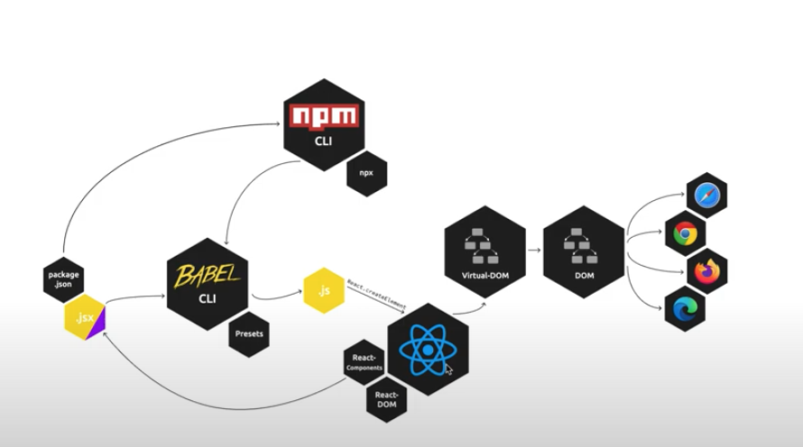

React




## Bedeutung

### Declerative:

Geben Überschrift daten mit, welche sie darstellen soll

(Imperativ): Wenn in HTML Überschrift verändern wollen, müssen wir eact diese Überschrift suchen

### Component-Based:

Viele kleine Komponenten ergeben eine große

### VIrtual-DOM:

Dokument Apstract Moden - Abstraktion des HTML in JavaScript


Ermöglich es über den Browser HTML mit JavaSript zu manipulieren 

Virtual Dom ist kopie des realen DOM in React

Änderungen, die wir durchführen, werden zuerst im Virtual Dom und dann im normalen DOM ausgeführt

 


- --reload erlaubt dem Server die Dateien in unseem Projekt zu beobachten uns bei einer Änderung, diese sofort im Browser darzustellen
- https://www.npmjs.com/package/servor


## Instalation mit React

1) Terminal: 

- npm init

- **Für React:**

  - npm install react 
  - npm i react-dom

- **Für die dev Umgebung**:

  ```bash
 npm install webpack webpack-dev-server webpack-cli babel-loader html-webpack-plugin @babel/core @babel/preset-react --save-dev
  ```

  - index.html

  - webpack

  - webpack-dev-server: **lokaler Webserver**

  - webpack-cli: **interaktion mit Webpack**

  - babel-loader: **damit webpack jsx-Datein verarbeiten kann**

  - html-webpack-plugin: **damit index.html in webpack u dem server verarbeitet werden kann**

  - @babel/core @babel/preset-react : f**ür Funktionsweise und compelierung von jsx-Dateien**
  
  - --save-dev: brauchen das alles nur für die Entwicklung und nicht während der Laufzeit
  
    

2) Erstellung eines src Ordners mit index.html file darin

- Einstiegspunkt :

  ```html
  body>
      <div id="my-react-app"></div> 
  </body>
  ```

3) Index.jsx file in src

- React und react-dom importieren

```
import React from 'react'
import ReactDom from 'react-dom'
```

- in Vorbereitung gleich App importieren 

4) Ordner app in src und App.jsx erstellen

```javascript
export class App extends React.Componente {
    render() {
        return(
            <h1></h1>
        );
    }
}
```

5) React.Dom Funktion in der index.jsx file erstellen und App einbinden

```javascript

import { App } from './app/App'

ReactDom.render(
    <App />,
    document.getElementById("my-react-app")
)
```

6) Babel.config.json anlegen

```json
{
  "presets": [
    "@babel/preset-react"
  ]
}
```

7) Webpack.config.js anlegen

```javascript
const path = require('path');
const HtmlWebPackPlugin = require('html-webpack-plugin');

module.exports = {
  entry: path.resolve("src", "index.jsx"),
  mode: "development",
  module: {
    rules: [
      {
        test: /\.(js|jsx)$/,
        exclude: /node_modules/,
        use: {
          loader: 'babel-loader'
        },
      },
      {
        test: /\.css$/,
        exclude: /node_modules/,
        use: [
          'style-loader',
          'css-loader'
        ]
      }
    ]
  },
  resolve: {
    extensions: [ '.js', '.jsx' ]
  },
  output: {
    path: path.resolve(__dirname, "dist"),
    filename: "bundle.js",
  },
  plugins: [
    new HtmlWebPackPlugin({
      template: path.join(__dirname, 'src', 'index.html'),
      filename: 'index.html'
    })
  ]
};

```


7) Scripte in package.json definieren:

```json
scripts": {
    "start": "webpack serve",
    "test": "echo \"Error: no test specified\" && exit 1"
  },
```


**Npm Start Problem:** 


## Erstellen eines Projekts im Ordner 

### 1) npm init:

erstellt Package.json Datei

### 2) index.html file anlegen

**index.html**

```html
<!DOCTYPE html>
<html lang="en">
<head>
    <meta charset="UTF-8">
    <meta name="viewport" content="width=device-width, initial-scale=1.0">
    <title>Einführung in React</title>
</head>
<body>
    <h1>Hello World</h1>
    <div id=react-app></div>
<script crossorigin src="https://unpkg.com/react@16/umd/react.development.js"></script>
<script crossorigin src="https://unpkg.com/react-dom@16/umd/react-dom.development.js"></script>
<script>src="./src/app.js"</script>
</body>
</html> 
```


- wenn React nicht über npm eingebettet wird, müssen CDN-URLs in die index datei geschrieben werden. Kann im development(mehr testtools dabei u deswegen größere Datei) oder production(kleiner u besser für produktiven Einsatz) modus eingeführt werden

  - https://reactjs.org/docs/cdn-links.html

  - ```html
    src="https://unpkg.com/react@16/umd/react.development.js"></script>
    <script crossorigin src="https://unpkg.com/react-dom@16/umd/react-dom.development.js"></script>
    ```

- Ein Skript text der auf unsere app.js verweht, wo der unser code ausgeführ wird mus serstellt werden

  - erstellen eine Ordners "src" und der Datei "app.js" im Projektapp.js

  - ```html
    <script>src="./src/app.js"</script>
    ```

- wohin wir unsere sachen gerendert haben wollen muss auch angegeben werden

  - ```html
    <div id=react-app></div>
    ```

### 3) Erstellen React-Elemnts in app.js:

## React Element:

- Grundlegendest Objekt in Virtual DOM

```react
React.creatElement("p",{id: "myId"}, "My Content")
```

1. Parameter: Tag
2. Parameter: Attribut
3. Parameter: Inhalt

```react

const myElement = React.createElement(
    "p",
    {},
    "Mein erstes React-Element"
)
```

- Zur Darstellung der Variable im Browser brauchen wir die render() Funktion, die uns ReactDOM liefert. 
- In der render() Funktion geben wir einmal unser Element an und dann wohin wir das gerendert haben wollen.

### 3) Babel konfigurieren:


**Babel Wörterbuch erstellen:**

- erstellen uns eine file namens: .babelrc.babelrc

- Babel übersetzt .jsx in js

  - Jsx = verschmelzung von HTML und JavaScript

- in die file schreiebn wir alle wärtetbücher, die wir übersetzten wollen

- ```html
  {
      "presetes": ["@babel/preset-react"]
  }
  ```

**Aus app.js wird app.jsx**

- Übersetzten mit babel im terminal: 

- ```bash
  npx babel src --out-dir lib
  ```

- Src: Verzeichnis das übersetzt werden soll

- --out-dir lib: wohin übersetzt werden  - Verzeichnis namens lib


## Skripte

in der package.json file unter "scripts" können alles Skripe dir wir brauchen eingfügt und dann mit npm run ausgeführt werden

```html
 "scripts": {
    "compile": "babel/ src --out-dir lib", 
  },
```


## React-Components:

Es gint hierbei Funktionale und Klassenbasierte-Components!

### Funktionale definition:

- Für funktional Programmierung 
  - Komponente wird als JavaScript Fuktion implementiert
  - Bekommt Properties mitgeliefert
  - Gibt JSX-Element/React-Element zurück

```react
function MyComponente(props) {
return(
<p>{this.props.text}</p>
);
}
```

### Klassenbasierte definiton:

- Für Objektorientiert Programmierung 
  - JavaScript Klasse wird erstellt und durch React.Component erweitert
  - React.Component verlangt eine render() Funktion
  - Die render() Funktion gint dann wieder eine JSX/React-Element zurück

```react
class MyComponent extends React.Component {
render() {
return(
<p>{this.props.text}</p>
)
 }
}
```


### Einbettung einer React-Komponente:

Geht auf 2 Arten:

1. Einbettung in der Obersten Komponente. Im React.DOM. Sollte nur FIx und fertige Komponente eingebettet werden

   ```react
   React.Dom.render(
   <MyComponent />
   document.getElementById("my-id")
   );
   ```

   

2. Einbettung in einer anderen React-Komponente. Sollte in einer Klassenbasiereten Komponente sein.

   ```react
   class MyOuterComponent extends React.Component {
   render() {
   return(
   <MyComponent />
   );
    }
   }
   ```

   

   - Über props kann man von außen verschiedene Varablen in die React-Komponente bringen und damit dann dinge tun.
   - **React-Komponenten können beliebig ineinander verschachtlet werden!**


- Input sind props
- Output ist ein React-Element

## ESM - Export and Import


Export und inport von Variablen, Objekte oder Klassen

Um das machen zu können, muss in der index.html unser Typ als module deklariert werden

### Verwednung von Props


- Werden von außen im Tag übergeben

  ```html
  <MyComponent myProps="Hallo" />
  ```

- Und innerhalb der Komponente dann ausgelesen:
  
- klassenbasiert mit **this.props.nameMeinerVarable**
  
- ```
  class MyComponent extends React.Componente {
  redner() {
  <p>{this.props.myProps}</p>
  return()
  }
  }
  ```

  - Funktional mit **props.nameMeinerVarable**

- ```
  function myComponent(props) {
  return(
  <p>{props.myProps}</p>
  )
  }
  ```

## Einbindung mit CSS:


Nicht empfohlen weil: Verlierne schnell überblich wenn jeden Komponent eigenen style hat..


CSS Datei muss dann noch in die index.html file eingebunden werden 


## React-State:


- Variablen, die sich zur Laufzeit ändern. State X kann gleich wieder ein andere State sein. 
- State = was wird im front-end dargestellt
- Userinteraktionen, API`s verändern States
- JSX-Varablen und props sind Objekte die den Zustand der App verändern können - sind aber Statis = initial gesetzt und ausgelesen (read-only)
- DIe render() Funktion wird be ider veränderung dieser Varibalen und porps nicht automatisch neu aufgerufen

**React verwaltet ein Objekt state, das über setState() verändert wird**

- über setState() bekommt react eine Veränderung mit und führt die render() Funktion nocheinmal aus

```javascript
class MyComponent extend React.Component {
constructor(props) {
super(props);
this.state = {myKey: "initialState"}
}

changeState() {
this.setState({myKey: "myNewValue"})
}

render() {
return (<p>{this.state.myKey}</p>)
}
}
```

**Ablauf**:

1. Unser key wird im Konstrukteur erstellen
2. Unsere render() Funktion stellt den Key in einem p-Tag da
3. Wenn wir unseren Key verändern wollen, müssen wir die Funktion changeState() die setState() enthält aufrufen

```javascript
export class Headline extends React.Component {
  constructor(props) {
    super(props);
    this.state = { myKey: "initialState" };
  }

  changeState() {
    this.setState({myKey: "myNewValue"})
    }

  render() {
    const myStyle = { color: "red" };
    //style={myStyle}

    setTimeout(() => {this.changeState()}, 2000 )
    return (
      <div>
        <h1 className="headline">{this.props.propsHeadline}</h1>
        <p>{this.state.myKey}</p>
      </div>
    );
  }
}
```

### Konstruktor:

Ist die initiale Funktion einer Klasse, die Klasse/Componente initialisiert wird. Wird immer einmal beim instanziieren aufgerufen. 

Der Konstruktor bekommt immer die aktuellen props als Parameter und diese werden über die super() Funktion immer weitergegeben. So das die Basisklasse auch zugriff auf die props bekommt.

```javascript
constructor(props) {
super(props);
}
```

### Unterscheid zwischen Props und State


- Öfteres Zugreifen auf This.state in setState() is nocht 100% möglich 

**Lösung**:


- setState() akzeptiert auch Funktionen als Parameter, die für uns dann genau den state ändern, wenn wir ihn brauchen. Bekommen dann den wriklich angepassten States u Props, wenn wir setState() so wie oben verwenden.

- Also wenn wir auf this.state in setState() zugreifen müssen, dann die obrige funktionsbasierte Variante verwenden.
- Wenn nicht, dann die andere Variante.  

Wenn render() Funktion länger braucht als unser setState() kann es zufehlern kommen. Auc hierfür gibt es hilfe .


- Mount-Komponenten: Befor die Komponente das alererste Mal auf den DOM gerendert wird
- Update-Komponenten: Passiert nach dem Aufruf von setState(). Dreht sich ums erneute Aufrufen von render()
- Unmount-Komponente: Aufruf kurz bevor eine Kompoente aus dem DOM entfernt wird

- **componentDidMount()** -> wird nach dem initialen render() aufgerufen.
- **shouldComponentUpdate()** -> zur Steuerung ob render aufgerufen werden soll oder nicht - true oder false
- **componentDidUpdate()** -> wird nach dem render() was durch ein setState() getriggerd wurde aufgerufen
- **componentWillUnmount()** -> wird Aufgerufen, kurz bevor die Komponente aus dem DOM entfernt wird - gibt keine danach Funktion

**Wann sollen die Lifecycles verwendet werden?**


- API-Calls erst wenn bereits gerendert  => componentDidMount()

```javaScript
<ImageChanger images= {images} interval = {3000}/>
        );
        
   changeImage() {
      this.setState((state, props) => {
          return {
            imageIndex: getNextIndex(this.props.images, state.imageIndex)
          }
          
      })
  }
  
   componentDidMount() {
    this.intervalID = setInterval(() => {
        console.log("Test")
        this.changeImage();
    }, this.props.interval);
  };
```

## User-Events

 

- mit this.NameDerFunktion wird verwiesen
- Übergabe ohne **()**, da wird es nur als Variable übergene wollen und sie soll erst aufgerufen werden, wenn der User Click. Mit **()** würde die Funtion sofart gerendert u ausgeführt werden u das wolle nwir nicht.

### ACHTUNG Stolperfalle mit this:


- tritt auf, wenn wir den Click-Event zur Manipuatione des States verwenden wollen. Weil in JavaSript mit die this nicht unbedingtauf die Insanz es Objektes verwiesen wird, sondern kann auc hauf de nAUfrufer verwiesen werden. Heißt: Da JAvaSript für uns den AUfruf mit this macht u nicht wir selbst, das das this in this.setState leider undefiniert u wir bekommen den Fehler "**Uncought TypeError"**

### Lösung:


- **Entweder** stat driekte Refernz auf die Funktion, eine **Arrow-Funktion** verwenden. Funktion mus jetzt aber mit () Übergeben werden
  - **() =>{}** Generiert Funtion für uns, bei der die this-refernz aufrecht gehalten wird. Ist als oimmer das Objekt der Instanz, die die Funktion kreiert
- **Oder** mit der eher empfohleren Variante **.bind(this)**.
  - this.click im Konstruktor mit this.click.bind(this) überschreiben. Sagt, wann immer die Funktion onClick aufgerufen wird ist this, die Instanz der Umgebendesn Objekts.
- Wenn der existierende State in der setState() Methode anpassen wollen, müssen wir das immer über iene Mehtode machen
- This.setState(state => { ........  return state})

## Immutability


- cup in filledCup() steht für den emptyCup
- hier ist emtYCup und filledCup das gleiche MACHT man NICHT!!


-  Statt nur cup zurück zu geben, erstellt die Funktion einen neuen CUp der mit true arbeitet


## Uplifting

- **Anforderung**:
  - Der selbe State soll in meheren Komponenten verwendet werden
- **Problem**:
  - State ist fest an eine einzige Komponente gebunden
- **Lösung**:
  - Verwendung von State in der ersten gemeinsamen Eltern-Komponenten
  - Weittergabe des geteilten states über props

## State-Stolperfallen

- Veränderbarer Zusand einer App zur Zeit X
  - Zustan im Fronden === Darstellung und Inhalte der App
  - Veränderung ausgelöst z.b. durch Userinteraktion, API-Antworten,....
- State-Management ist nicht leicht
  - Veränderungen werden oft asynchron ausgelöst und verarbeitet
  - State wirkt sich oft auf mehrere Komponenten gleichzeitig aus
  - State leitet sich oft voneinander ab
  - State im Froenend ist oft selbst nur eine Replikation oder Synchronisation 
- State-Management wirkt oft sehr komplex
- Auswirkungen
  - Als Entwickler schwer, die Übersicht zu behalten
  - Statte ist schwer reproduzierbar u deswegen nur schwer und langsam zu testen
  - Fehler können katastrophale Auswirkungen bis hin zur Unbenutzbarkeit der App haben

## Vereinfachungen

- **Devide and C onquer**
  - Deklarative atomare Komponenten verwenden
  - State-Management von der darstellung trennen (Container und Statless-Cpmponents)
- Vorhersagbarkeit und Kontrolle erhöhen
  - Immutability und Pure Components verwenden
  - State kontrolliert, (übre Funktionen) verändern
  - Wenn nötig zentralen State nutzen


## React-Forms:

### Inputs :

- haben eigernen interne State 

- Wird über state-Objekt verwaltet

- Um Input -State zu nutzen muss die Controlle komplett an react übergeben werden

- wird **Controlled Components** genannt

  - ```
    <from onSubmit={this.onSubmit}>
    <input type = "text"
    value= {this.state.value}
    onChange={this.onChange}
    >
    </form>
    ```

- Event.target zeigt auf das html element

- Event.target.value gibt mir den eingegebene wert

- State auf eingäbe setzten;

  - ```
    handleChange(event) {
    console.log(event.target.value);
    this.setState({
        name: event.target.value
    })
    
    <input type="text" value={this.state.name} onChange={this.handleChange} />
    ```

### Select Input

- Vorauswhal für den user

  - ```html
      handleShirtSizeChange(event) {
        this.setState({
          shirtSize: event.target.value,
        });
      }
      
    <select
              value={this.state.shirtSize}
              onChange={this.handleShirtSizeChange}
            >
              <option value="w-s">W-S</option>
              <option value="w-m">W-M</option>
              <option value="w-l">W-L</option>
              <option value="m-s">M-S</option>
              <option value="m-m">M-M</option>
              <option value="m-l">M-L</option>
            </select>
    ```

  ### 

### Checkbox:

- benötigen keine value-Property, sondern einen boolsche check-Property

  - ```
    constructor(props) {
        super(props);
        this.state = {
          name: "",
          shirtSize: "w-s",
          lunch: false,
        };
        //this binding
        this.handleChange = this.handleChange.bind(this);
        this.handleShirtSizeChange = this.handleShirtSizeChange.bind(this);
        this.hanldeCheckedChange = this.hanldeCheckedChange.bind(this);
    
    
    hanldeCheckedChange(event) {
          this.setState(
              {lunch: event.target.checked}
          )
      }
      
       <label htmlFor="checkbox">Willst du Mittagessen</label>
            <input
              id="checkbox"
              type="checkbox"
              checked={this.state.lunch}
              onChange={this.hanldeCheckedChange}
            />
    ```

  - 

### Computed property names

const myKey = "keyName";

const myObject = {

[myKey] : "value"

}

Console.log(myObject.keyName);

Console.log(myObject[myKey]);

- [event.target.name] --> vergebenden Key eines Objektes dynamisieren

  - Als keywird jetzt der Inhalt von **event.target.name** genommen
  - in html dann name = "wert"

  ```html
   handleChange(event) {
        console.log(event.target.name);
      this.setState({
        [event.target.target]: event.target.value,
      });
    }
    
    label>
            Name:
            <input
            -->  name="name"
              type="text"
              value={this.state.name}
              onChange={this.handleChange}
            />
          </label>
  
    <input
            id="checkbox"
           --> name="lunch"
            type="checkbox"
            checked={this.state.lunch}
            onChange={this.handleChange}
          />
  ```


### Object-Spread

- Js Funktion zum kopieren (Immutebility) von Elementen von einem in das andereObjekt

  - ``` 
    const cup = {filled: false, label: "Best React Developer"};
    const filledCup = {
    ...cup // ... -> wenn mehre element hinein kommen können 
    filled: true
    };
    consol.log(filledCup);
    ```


### Konditionales Rendern

- Jsx ist pures JavaScript
  - So lassen sich auch alle Js-Funktionen nutzen
- Mit einer if-Bedingung können wir ein einer Komponente unterschiedliche Outputs rendern

```
render( {
if(this.stats is loading) {
return (<h1>Still loading......<h1>)
} else {
return ( <ResultView values={this.state.result }/>)
}
})
```


### Veränderte if-abfrage

- Condition ? Wenn true : wenn false

  - ```javascript
    const value = event.target.name == "lunch" ? event.target.checked : event.target.value
    
     this.setState({
          [event.target.target]: value
        });
    ```

### Listen in React

-  sind gleichartige React.Komponenten, die sich nur in ihrem Inhalt unterscheiden(props)

  - Kex-Property muss gesetzt werden

- ```
  render() {
  const sourceArray = [1,2,3];
  const lieElements = sourceArray.map(currentNum => {
  return (<li key={currentNum}>{currentNum}</li>)
  });
  return (<ul>{liElements}</ul>)
  }
  
  ```

- ```
  <ul>
  <li key="1">1</li>
  <li key="2">2</li>
  <li key="3">3</li>
  </ul>
  ```

- 

- map.Funktion: kann auf array angewandt werden und itteriert durch jedes einzelne Element des array u speichert rückgabewert der finktion in neuem Array

### Object-Destructuring

- Entnahme von properties eines Objektes in gleichnamigen Variablen

  - Ersparrt uns Code-Dublication

  ```javascript
  const sourceObject = {
  name: "Berry Allen",
  heroName: "Flesh",
  superPoweer: "Speed"
  }
  
  const {heroName, superPower} = sourceObject;
  
  console.log(heroName);
  console.log(superPower );
  
  //gleich wie
  
  console.log(sourceObject.heroName);
  console.log(sourceObject.superPower );
  
  //Klappt auch mit Arrrays
  const sourceArrray = ["The Flash", "Speed"];
  const [heroName, superPower] = sourceArrray;
  
  const heroName = sourceArray[0];
  const superPower = sourceArray[1];
  ```


### Wrapper-Components

- Komponenten die andere komponente numschließen
  - Die äußerste Komponente (Wrapper) kennt de nInhalt der inneren (Child) nicht
  - Wird oft gür abstraktes Verhalten oder gemeinsames Styling verwendet (Sliders,Tabs)
- Erlaubt sehr generische, wiederverwendbare Komponentenentwicklung

```javascript
<Slider>
<Image content = "Image"/>
<text = content "My Text"/>
<GenericContent content= "other content"/>
</Slider>
```


- Zugriff auf innere Komponenten über props.children

```javascript
class RedBorder extends React.Componente {
render() {
const styles = {border: "solid red"};

return(
<div style={styles}{this.props.children}> </div>
)
}
}
```


```html
<RedBorder>
<p> Dieser Text hat einen roten rand</p>
</RedBorder>
```


- Zugriff auf props (und state) der kindkomponente möglich
- Beispiel Tabs mit Überschrift
- App.jsx

```html
render () {
    return (
      <TabController>
        <Tab headline="Registrierung React-Workshop">
          <RegisterForm onSubmit={this.handleSubmit} />
        </Tab>
        <Tab headline="Teilnehmendeliste">
          <Attendeelist attendees={this.state.attendeelist} />
        </Tab>
      </TabController>
    );
  }
```


- Überschrifte nsollen in der Tab-Auswahl angezeigt werden

```react
export class TabController extends Component {
    constructor(props){
        super(props)
        this.state={
            activeTab: 0
        }

        this.switchTab = this.switchTab.bind(this);
    }

    switchTab(newIndex) {
        this.setState({
            activeTab: newIndex
        })
    }
  render() {
    const tabSelection = this.props.children.map((tab, index) => {
        const key= 'tab-${index}' ;
        const content = index == this.state.activeTab ?
        (<b>{tab.props.headline}</b>) : (<i>{tab.props.headline}</i>)

      return (
        <li key={key}>
          <a href="#" onClick={()=> this.switchTab(index)}>
            {content}
          </a>
        </li>
      );
    });
 
    return (
      <div>
        <nav>
          <ul>{tabSelection}</ul>
        </nav>
        {this.props.children[this.state.activeTab]}
      </div>
    );
  }
}

```


- In der Tap.jsx

```react
export class Tab extends Component {
    render() {
        return (
            <div>
                <h1>{this.props.headline}</h1>
                <article>{this.props.children}</article>
            </div>
        )
    }
}

```


### React.Fragment

- Jsx-Element das nicht gerendert wird
  - Zur Rückgabe von HTML-Geschwister-Elemente in einer Komponente
  - Verhindert unnötige "<div>"- oder sonstige Platzhalter-Elemente im HTML

```react
redner() {
return(
<React.Fragment>
 <h1>Headline</h1>
 <p>Text</p>
</React.Fragment>
)
}
```


## Ablauf eines Programms:

1. componentWillMount() {/** Bevor die Seite geladen ist */}
2. render(){/** Alles was hier steht, wird immer ausgeführt, wenn sich eine prop oder der state ändert ausgeführt. aber nur das was geändert wird*/}
3. componentDidMount() {
   /**Wenn die Seite geladne ist  */
   this.setState({ anzahl: this.state.anzahl + 5 });
     }s

## Dies das:

- Aktuelle Version: **16.13.1** = 
  - 16-->Major, erhör sich wenn sich an der API ein "Breaking change" ändert. Es hat sich grob was an der Application geänder
  -  13 --> Minor, erhöht sich, wenn z.b. Additive Aänerung - neu features in der Library 
  - 1--> Patch, sind Bugfixes oder andere kleine Änderungen
- Natives JavaSript wir in {eckigen Klammern geschrieben}
- "#" bei <a> href verhindert das beim klick eine navigation ausgeführt wird
- Wenn ein Object Null sein kann dann abfrage: if(!nextCycle){return null}

### Schnell Erstellung:

1. npm init 
2. npm install create-react-app
3. Npx create-react-app nammederapp

### Schnelle Erstellung2:

1. npm init
2. npm install react reactdom

3. npm install webpack webpack-dev-server webpack-cli babel-loader html-webpack-plugin @babel/core @babel/preset-react --save-dev

