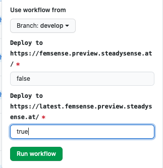

#Login

Manuel.medwed@steadysense.at

Manu1622!#

## Crossplatform auf Handy:

- In capacitor.config.json in main root:

```
"server": {"url": "http://192.168.0.24:3000"}
```

- Path for Android: `android/app/src/main/assets/capacitor.config.json`
- Path for iOS: `ios/App/App/capacitor.config.json`
- npm run build sync  
- npx cap copy ios  
- npx cap open ios  


- chrome://inspect/#devices

```
const [rangeValue, setRangeValue] = useEffect<{
  lower: number;
  upper: number;
}>({ lower: minLength ?? 0, upper: maxLength ?? 0 });
```


```
const [rangeValue, setRangeValue] = useState<{
  lower: number;
  upper: number;
}>({ lower: minLength ?? 0, upper: maxLength ?? 0 });

useEffect(() => {
}, [rangeValue]);
```

## Cropssplatform

### Classen:

```typescript
class NameDerKlasse extends React.Component<AppState> {}
```

### Export der klassse

```
export const MyVarableName = connect<AppState, {}, {}, AppState>((state: AppState) => {
return state
}(NameDerKlasse)
)
```

### backend Account bearbeiten

```
curl\
  -X POST -d '{"email":"tester1622@femsense.com","password":"testermtesterm"}'\
  -X POST -d '{"email":"donot017@gmx.net","password":"donot019!"}'\
 -H "Accept: application/json" \
 -H "Content-Type: application/json" \
https://app.staging.femsense.com/api/v1/auth/login/
```

```

curl\
  -X POST -d '{"email":"todayscreentest@femsense.at","password":"donot019"}'\ 
 -H "Accept: application/json" \
 -H "Content-Type: application/json" \
```

```
curl\
  -X POST -d '{"email":"uitestaccount@femsense.at","password":"donot019"}'\
 -H "Accept: application/json" \
 -H "Content-Type: application/json" \
https://app.staging.femsense.com/api/v1/auth/login/

```

```
curl\
  -X POST -d '{"email":"e2etests@femsense.com","password":"donot019"}'\
 -H "Accept: application/json" \
 -H "Content-Type: application/json" \
https://app.staging.femsense.com/api/v1/auth/login/


```


## Eigener Account

- {"key":"68f01bda117c78c9b1b10389f4f600bfeac531c5"}%    
  -  curl\
      -X POST -d '{"email":"tester1622@femsense.com","password":"testermtesterm"}'\
     -H "Accept: application/json" \
     -H "Content-Type: application/json" \
    https://app.staging.femsense.com/api/v1/auth/login/

- Tokken der da rauskommt dann in femsense-capasitor-browser.ts eingeben
- dann im femsense backend suchen

cmd K -> commit

Cmd opt K

feature/CalendarBarDesignUpdate

feature/todayScreenNoCycleFound

### d721739bfdc383460077f400842d8aedf456e3ac

 react-app-rewired

Android release pwd:

### Ios chash löschen:

 rm -rf /Users/mamed/Library/Developer/Xcode/DerivedData/

## Femsense preview side

PR --> actions --> CI --> Run Workflow --> Branch auswählen --> false u. True --> Run workflow

```
https://latest.femsense.preview.steadysense.at/#/InstructionsForUse
```



```
76d2425a7be5b98b95d6c86f61f93bd36e822705
```

### Native code in x-Platform verwenden

- Femsesne-capacitor:

  - Name der Funktion hinzufügen

  ```json
  type NativeOp =
    | "SAVE_AUTH_TOKEN"
    | "FINISH_BODY_PROFILE"
    | "LOGOUT"
    | "REFRESH_BACKEND"
    | "CONTACT_SUPPORT"
    | "SWITCH_ENDPOINT"
    | "REGISTER_PUSH_NOTIFICATIONS";
  ```

- Funktion erstellen mit doNativOp

  ```react
  export function registerPushNotification() {
    doNativeOp({ nativeOp: "REGISTER_PUSH_NOTIFICATIONS" });
  }
  ```

- X-Platform: Constructor in der Klasse erstellen u function aufrufen

  ```react
  import { registerPushNotification } from "../femsense-capacitor/femsense-capacitor";
  
  export class TabToday extends React.Component<RouteComponentProps> {
    constructor(props: RouteComponentProps) {
      super(props);
      registerPushNotification();
    }
  ```

  

- Im Native Code von FemSenseCapacitor.swift unter doNativeCall:

  ```swift
      @objc func doNativeCall(_ call: CAPPluginCall) {
          guard let nativeOp: String = call.getString("nativeOp") else {
              return rejectWithError(call, "Missing nativeOp")
          }
          DispatchQueue.main.async {
              if nativeOp == "REFRESH_BACKEND" {
                  self.refreshBackend()
              } else if nativeOp == "CONTACT_SUPPORT" {
                  self.sendContactMailOrOpenWebsite(mailComposeDelegate: self)
              } else if nativeOp == "SAVE_AUTH_TOKEN" {
                  self.saveAuthToken(call: call)
              } else if nativeOp == "FINISH_BODY_PROFILE" {
                  self.finishBodyProfile(call: call)
              } else if nativeOp == "LOGOUT" {
                  self.doLogout()
              } else if nativeOp == "SWITCH_ENDPOINT" {
                  self.saveEndpoint(call: call)
                  self.doLogout()
              } else if nativeOp == "REGISTER_PUSH_NOTIFICATIONS" {
                  self.registerPushNotification()
              } else {
                  return self.rejectWithError(call, "Unknown nativeOp " + nativeOp)
              }
          }
          call.resolve()
      }
  ```

  

- Und auch eigentliche Funktion schreiben

  ```swift
    func registerPushNotification() {
          UNUserNotificationCenter.current().requestAuthorization(options: [.alert, .sound, .badge]) { (_, _) in
              print("registerPushNotification (isGranted)")
           }
          }
  ```

  


# Android Studio WebVev-Debugger Live-Load

- In WebView.java

  ```
  @NativePlugin()
  public static void setWebContentsDebuggingEnabled (boolean enabled){
    if (Build.VERSION.SDK_INT >= Build.VERSION_CODES.KITKAT) {
      WebView.setWebContentsDebuggingEnabled(true);
    }
  }
  ```

## iOS Studio WebVev-Debugger Live-Load

in capacitor.config.json add

```
"server": {
    "url": "http://localhost:3000",
    "cleartext": true
  }
```


## CC

<!---
project-id: " "

template-title: Change Control Request
template-identifier: FB_3.1_01
template-version: 8
template-author: Alexander Adelmann
template-creation-date: 2020-08-12
template-reviewer: Werner Koele
template-review-date: 2020-08-12
template-approver: Werner Koele
template-approval-date: 2020-08-12
--->

# Change Control Request `CC-392`

Link to PB 3.1 04 Change Control: https://github.com/steadysense/SteadySense/blob/master/QM-documents/3.1_Qualitäts_Mgt_IT/PB_3.1_04_Change_Control.md

# Part A

## Cause

- Local-Notification are not send to users in iOS

## Description

- Update app to ask for permission to send Push-Notifications

| Product Name       | SW   | SW-Version | Comments            |
| ------------------ | ---- | ---------- | ------------------- |
| femSense Fertility | App  | v2.01      | Local Notifications |

# Part B

## Type of Change Control

Guideline: https://github.com/steadysense/SteadySense/wiki/Significant-Change---Guidance

| Change Number (See Guidance)                            | Description of the Change                                   | Regulation (FDA/MDR) | Comment |
| ------------------------------------------------------- | ----------------------------------------------------------- | -------------------- | ------- |
| Changes that do not have to be reported - 5 (Bug fixes) | Update app to ask for permission to send Push-Notifications | FDA/MDR              |         |

  - [ ] **Significant Change (Notifiable)**
  - [x] **Non-Significant Change**

## Documentation

> Check affected areas and list all changes including the related documents here.

**Affected areas:**

  - [ ] Intended Use
  - [x] Specifications
  - [ ] Risk Management
  - [ ] Usability Engineering
  - [ ] Clinical Evaluation
  - [x] Product delevopment files (=project folder), design history file, design history record
  - [ ] Contracts
  - [ ] Conformity assessment or declaration of conformity
  - [ ] Other: 

| Description of Change | Affected Document(s)                          | Responsible |
| --------------------- | --------------------------------------------- | ----------- |
| Test-Specification    | https://github.com/steadysense/Fem04/pull/100 | @MedManu    |
| Test-Protocol         | https://github.com/steadysense/Fem04/pull/100 | @MedManu    |
| Traceability_Matrix   | https://github.com/steadysense/Fem04/pull/100 | @MedManu    |
| App update            |                                               | @MedManu    |

## Timeline

 KW 32: implementation + tests + release

## Costs

1 developer week

## Responsibilities

- Department representative: @wkoele
- Quality management representative: @AlexAdelmann
- Project Manager: @kstrohma

| Release of SW-Version | Date |
| --------------------- | ---- |
|                       |      |

# Part C

## Plan - Effectivity

> Insert the plan for the review of effectiveness (including a timeline) here after implementation is finished and reviewed.

## Verification -Effectivity

> Insert the proof of effectiveness here.


 http://localhost:8080